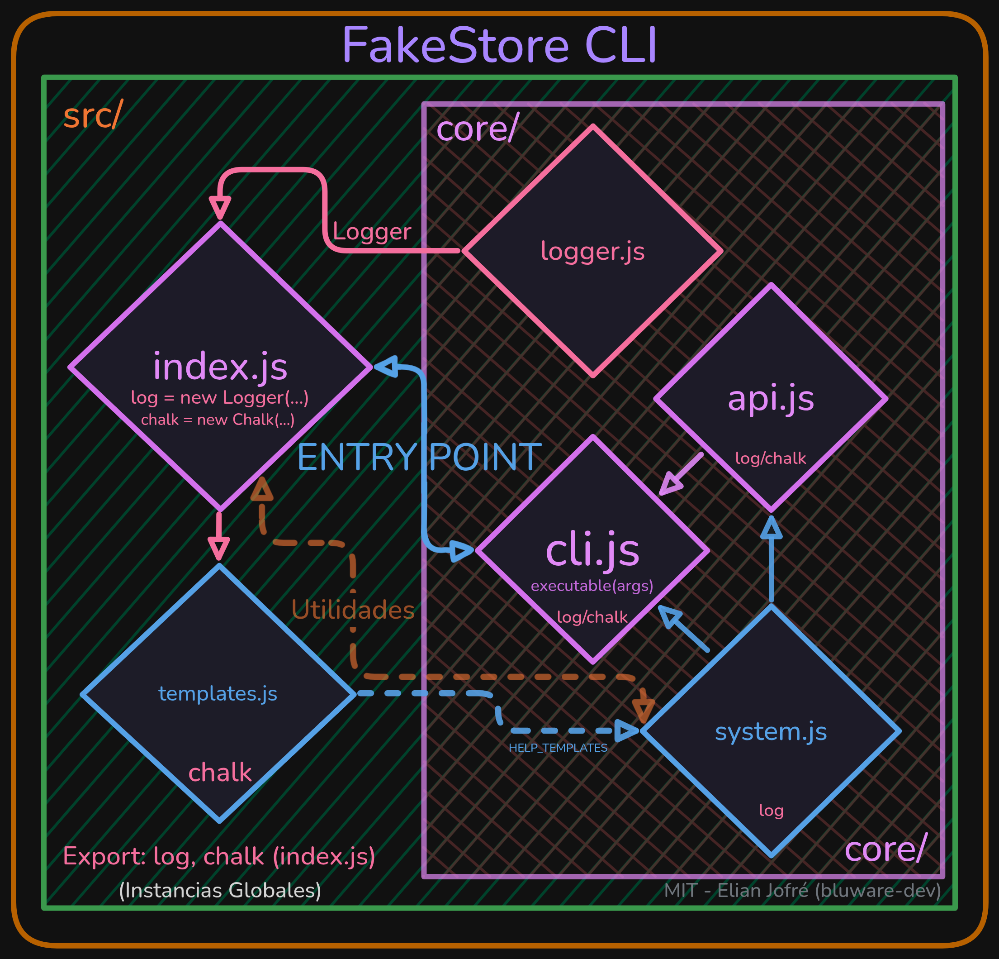

<h1 align="center"><b>FakeStore CLI</b></h1>
<p align="center">
  
  
  
</p>

<pre align="center">
░█▀▀░█▀█░█░█░█▀▀░░░█▀▀░▀█▀░█▀█░█▀▄░█▀▀░░░░░░░░░█▀▀░█░░░▀█▀
░█▀▀░█▀█░█▀▄░█▀▀░░░▀▀█░░█░░█░█░█▀▄░█▀▀░░░▄▄▄░░░█░░░█░░░░█░
░▀░░░▀░▀░▀░▀░▀▀▀░░░▀▀▀░░▀░░▀▀▀░▀░▀░▀▀▀░░░░░░░░░▀▀▀░▀▀▀░▀▀▀
</pre>

<p align="center">
<em>CLI minimalista para interactuar con la API pública de <a href="https://fakestoreapi.com">FakeStoreAPI</a>, escrito en JavaScript puro usando <code>process.argv</code>, limpio y modular.</em>
</p>

---

<h3 align="center">Características</h3>

<p align="center">

✅ <b>CLI modular</b> basado en un layout declarativo.<br>
✅ <b>Logger</b> personalizado con <code>chalk</code> y control de depuracion `--debug`.<br>
✅ <b>Validaciones estrictas</b> de argumentos y operandos.<br>
✅ <b>Manejo de errores</b> adaptativos y return code exits para manejo de entradas.<br>
✅ <b>Arquitectura limpia tipo UNIX</b>, sostenible y escalable.<br>
⚠️ <b>Soporte de endpoints:</b> solo `products` es 100% funcional, los demás endpoints (`carts`, `users`) funcionan únicamente para `GET` y `DELETE`<br>

</p>

---

<h3 align="center">📖 Instalación + Uso</h3>

```bash
# Instalacion
git clone https://github.com/bluware-dev/fakestore-cli.git
cd fakestore-cli/
npm install # o pnpm install
```

```bash
# Uso
npm start <COMANDO> [args]
# o
pnpm start <COMANDO> [args]
```

---

<div align="center">

<h3 align="center">📜 Comandos disponibles</h3>

| Método        | Descripción                 | Ejemplo                                        |
| ------------- | --------------------------- | ---------------------------------------------- |
| 🟢 **POST**   | Crear un producto           | `npm start POST products "Camisa" 29.99 ropa`  |
| 🟡 **PUT**    | Actualizar un producto      | `npm start PUT products/1 "Camisa" 39.99 ropa` |
| 🔵 **GET**    | Obtener un producto         | `npm start GET products/1`                     |
| 🔴 **DELETE** | Eliminar un producto        | `npm start DELETE products/1`                  |
| 🧩 **HELP**   | Mostrar ayuda contextual    | `npm start POST help`                          |

---

<h3 align="center">⛳️ Flags</h3>

| Flag           | Descripción                                                            |
| -------------- | ---------------------------------------------------------------------- |
| `-h`, `--help` | Muestra ayuda global o contextual (NPM: `npm start help`)              |
| `--no-ansi`    | Desactiva colores en consola (NPM: `npm start -- --no-ansi ...[args]`) |
| `--debug`      | Habilita modo depuración (NPM: `npm run debug ...[args]`)              |

</div>

---

<h3 align="center">🏗️ Estructura del proyecto</h3>

```
src/
 ├── index.js            # Punto de entrada principal (CLI bootstrap)
 ├── templates.js        # Esquemas de mensajes de ayuda
 └── core/
     ├── cli.js          # Layout y lógica de binding
     ├── logger.js       # Sistema de logging con chalk
     ├── system.js       # Utilidades del CLI (builder, validator, display)
     └── api.js          # Integración con FakeStoreAPI
```

<p align="center">
  
</p>

---

<h3 align="center">Ejemplo de uso</h3>

```bash
$ npm start get products/1
```

**Salida esperada:**

```json
{
	"id": 1,
	"title": "Fjallraven - Foldsack No. 1 Backpack, Fits 15 Laptops",
	"price": 109.95,
	"description": "Your perfect pack for everyday use and walks in the forest. Stash your laptop (up to 15 inches) in the padded sleeve, your everyday",
	"category": "men's clothing",
	"image": "https://fakestoreapi.com/img/81fPKd-2AYL._AC_SL1500_t.png",
	"rating": {
		"rate": 3.9,
		"count": 120
	}
}
```

---

<h3 align="center">💻️✍️ Filosofía</h3>

<p align="center">
<em>
Este repositorio, su código y estructura se inspira en la filosofía UNIX: 
</br>
<code>"Escribe programas que hagan una cosa y la hagan bien. Escribe programas para trabajar juntos. Escribe programas para manejar flujos de texto, porque esa es una interfaz universal"</code>
</br>
En el caso de este repositorio: código legible, declarativo/funcional y modular (pero sin excederse dado el minimalismo de la tarea a realizar).
</em>
</p>

---

> Nota: Este proyecto fue desarrollado íntegramente por mi (Elian "Blu" Jofré) [bluware-dev]. Se utilizaron herramientas de apoyo técnico solo como referencia documental. Sin embargo, **no** se utilizaron herramientas como: Copilot, CodeAI CLIs, Cursor/Windsurf o MCPs.

---

<h3 align="center">Autor</h3>

<table align="center">
	<tr>
		<td align="center">
			<a href="https://github.com/bluware-dev"><br /><b>Elian (Blu)</b></a><br/>Software Developer
		</td>
	</tr>
</table>

---

<h3 align="center">
	<a href="LICENSE">Licencia MIT ✍️</a>
</h3>
